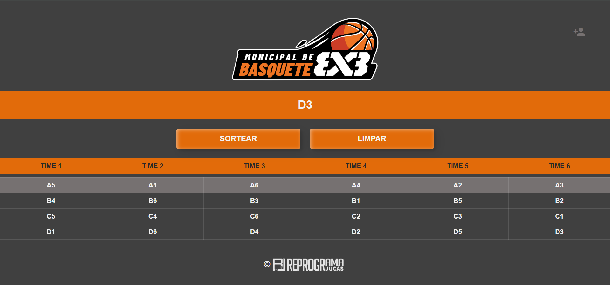

# Basketball-Draw-3x3

The React application developed to draw 3x3 basketball tournaments offers users the functionality to register players and organize them into skill pots, enabling automated draws and the formation of balanced teams.



## Features

- Player Registration: Allows organizers to register players including name and pot for draw.

- Group players according to skill criteria, where the first pot represents the seeded players to balance the competition.

- Automated Team Draw: Performs an automated draw to form balanced teams, considering the distribution of players in the skill pots.

- Visualization of Formed Teams: After the draw, displays the formed teams, highlighting each team and the players.

## Technologies

- `React`
- `TypeScript`
- `Style Components`
- `React Router DOM`
- `React Hook Form`
- `React Beautiful DND`

## Project Configuration

```bash
# clone the repository
$ git clone https://github.com/EmanuelQuintino/Basketball-3x3-Draw.git

# install dependencies
$ npm install

# run the project
$ npm run dev
```

## Links

- [Deploy](https://basketball-3x3-draw.vercel.app/)
